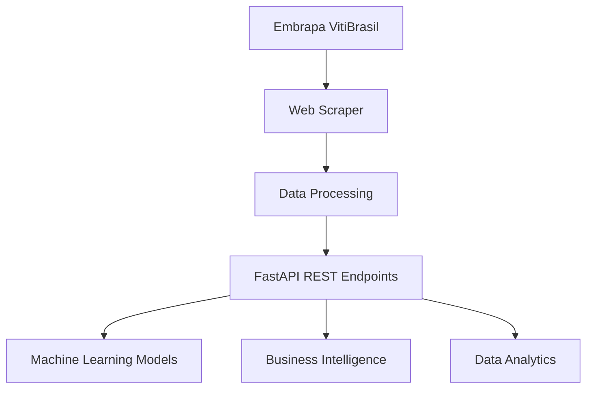

# 🍇 VitiData API - Sistema de Análise de Dados Vitivinícolas

[](https://python.org)
[](https://fastapi.tiangolo.com)
[](https://docker.com)
[](LICENSE)

## 📋 Sobre o Projeto

O **VitiData API** é uma solução completa para coleta, processamento e disponibilização de dados de vitivinicultura do Brasil, desenvolvida como parte do **Tech Challenge - Fase 1** do curso de Machine Learning Engineering. 

Este sistema extrai dados em tempo real do portal [Embrapa VitiBrasil](http://vitibrasil.cnpuv.embrapa.br), transformando informações dispersas em uma API REST estruturada e documentada, pronta para alimentar modelos de Machine Learning e análises estratégicas do setor vitivinícola.

### 🎯 Objetivos do Projeto

- **Democratizar o acesso** aos dados oficiais de vitivinicultura brasileira
- **Criar uma fonte confiável** para análises de mercado e pesquisas acadêmicas  
- **Estabelecer base de dados** para futuros modelos de Machine Learning
- **Facilitar integração** com sistemas de BI e dashboards analíticos

---

## 🏗️ Arquitetura da Solução



### Componentes Principais:

1. **Web Scraper**: Selenium + BeautifulSoup para extração automatizada
2. **Data Processing**: Pandas para limpeza e estruturação dos dados
3. **REST API**: FastAPI para exposição dos endpoints
4. **Containerização**: Docker para padronização de ambiente
5. **Deploy**: Render para hospedagem em nuvem

---

## 🔧 Stack Tecnológica

| Categoria | Tecnologia | Versão | Propósito |
|-----------|------------|---------|-----------|
| **Backend** | Python | 3.11 | Linguagem principal |
| **API Framework** | FastAPI | Latest | Framework web moderno |
| **Web Server** | Uvicorn | Latest | Servidor ASGI |
| **Web Scraping** | Selenium | Latest | Automação de navegador |
| **HTML Parsing** | BeautifulSoup4 | Latest | Extração de dados HTML |
| **Data Processing** | Pandas | Latest | Manipulação de dados |
| **Containerização** | Docker | Latest | Ambiente padronizado |
| **Deploy** | Render | - | Plataforma de hospedagem |

---

## 📊 Endpoints Disponíveis

### Base URL: `https://your-app-name.onrender.com`

| Método | Endpoint | Descrição | Dados Retornados |
|--------|----------|-----------|------------------|
| `GET` | `/` | Página inicial da API | Informações básicas |
| `GET` | `/healthz` | Health check do serviço | Status da aplicação |
| `GET` | `/producao` | Dados de produção vinícola | Produção por região/ano |
| `GET` | `/processamento` | Dados de processamento | Volume processado |
| `GET` | `/comercializacao` | Dados de comercialização | Vendas no mercado interno |
| `GET` | `/importacao` | Dados de importação | Produtos importados |
| `GET` | `/exportacao` | Dados de exportação | Produtos exportados |
| `GET` | `/docs` | Documentação interativa | Swagger UI |
| `GET` | `/redoc` | Documentação alternativa | ReDoc UI |

### 📝 Exemplo de Resposta

```json
{
  "status": "success",
  "data": [
    {
      "ano": 2023,
      "produto": "Vinho de Mesa",
      "quantidade": 123456789,
      "unidade": "litros"
    }
  ],
  "total_records": 150,
  "source": "Embrapa VitiBrasil",
  "last_updated": "2024-03-15T10:30:00Z"
}
```

---

## 🚀 Guia de Instalação e Uso

### Pré-requisitos

- Python 3.11+
- Git
- Docker (opcional)

### 💻 Instalação Local

1. **Clone o repositório**
```bash
git clone https://github.com/seu-usuario/VitiData.git
cd VitiData
```

2. **Configure o ambiente virtual**
```bash
python -m venv venv
source venv/bin/activate  # Linux/Mac
# ou
venv\Scripts\activate     # Windows
```

3. **Instale as dependências**
```bash
pip install -r requirements.txt
```

4. **Execute a aplicação**
```bash
uvicorn run:app --reload --host 0.0.0.0 --port 8000
```

5. **Acesse a documentação**
   - Swagger UI: [http://localhost:8000/docs](http://localhost:8000/docs)
   - ReDoc: [http://localhost:8000/redoc](http://localhost:8000/redoc)

### 🐳 Execução com Docker

```bash
# Build da imagem
docker build -t vitidata-api .

# Execução do container
docker run -d -p 8000:8000 --name vitidata vitidata-api

# Verificar logs
docker logs vitidata
```

### ☁️ Acesso em Produção

A API está disponível em produção através do Render:

**URL Base**: `https://vitidata-api.onrender.com`

**Documentação**: `https://vitidata-api.onrender.com/docs`

---

## 📁 Estrutura do Projeto

```
VitiData/
├── 📁 app/                     # Módulo principal da aplicação
│   ├── 📄 __init__.py         # Inicialização do módulo
│   ├── 📄 scraper.py          # Funções de web scraping
│   ├── 📄 models.py           # Modelos de dados (Pydantic)
│   └── 📄 utils.py            # Funções utilitárias
├── 📄 run.py                   # Aplicação FastAPI principal
├── 📄 requirements.txt         # Dependências Python
├── 📄 Dockerfile              # Configuração Docker
├── 📄 .gitignore              # Arquivos ignorados pelo Git
└── 📄 README.md               # Este arquivo
```

---


## 🧪 Testes e Validação

### Executar Testes

```bash
# Instalar dependências de teste
pip install pytest pytest-asyncio httpx

# Executar todos os testes
pytest

# Executar com cobertura
pytest --cov=app
```

### Teste Manual dos Endpoints

```bash
# Verificar saúde da API
curl https://vitidata-api.onrender.com/healthz

# Obter dados de produção
curl https://vitidata-api.onrender.com/producao
```

---


## 📄 Licença

Este projeto está licenciado sob a Licença MIT - veja o arquivo [LICENSE](LICENSE) para detalhes.

---

## 👨‍💻 Autores

**Matheus Pavani**
- GitHub: [@seu-usuario](https://github.com/seu-usuario)
- LinkedIn: [Seu Perfil](https://linkedin.com/in/seu-perfil)
- Email: seu-email@exemplo.com

---
